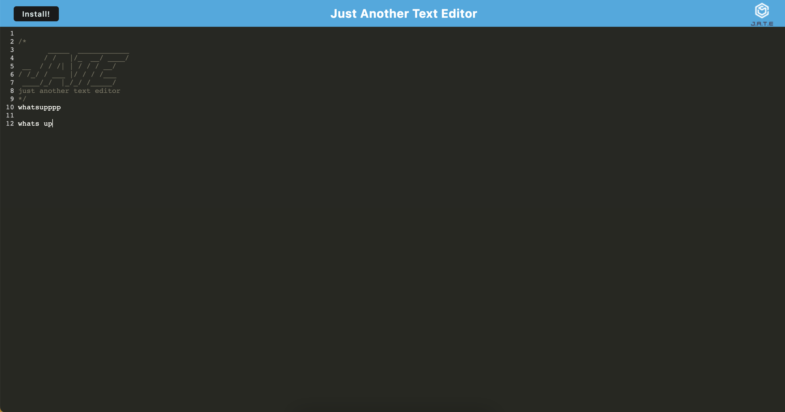

# J.A.T.E: Just Another Text Editor

## Description
J.A.T.E is a text editor that runs in the browser. It is a single-page application that meets PWA criteria. Additionally, it features a number of data persistence techniques that serve as redundancy in case one of the options is not supported by the browser. The application can also function offline.

Here's the link to check it out for yourself: [click here](https://jate-ide-pwa.herokuapp.com/).

## Screenshots
How the application looks:


# Table of Contents
* [Installation](#installation)
* [Usage](#usage)
* [License](#license)
* [Contributing](#contributing)
* [Technologies Used](#technologies-used)
* [Code Snippets](#code-snippets)
* [Questions](#questions)
* [User Information](#user-information)

## Installation
To install necessary dependencies, run the following command:
```
npm i
```
To run the database and client-side simultaneously, run the following command:
```
npm run start:dev
```

## Usage
Install the dependencies and you're ready to go.

## License 
This project is licensed under the MIT license.

## Contributing
Contact me.

## Technologies Used
- Node.js
- IndexedDB
- Express
- Webpack
- Workbox/Service Workers
- Babel

## Code Snippets
```javascript
const initdb = async () =>
  openDB('jate', 1, {
    upgrade(db) {
      if (db.objectStoreNames.contains('jate')) {
        console.log('jate database already exists');
        return;
      }
      db.createObjectStore('jate', { keyPath: 'id', autoIncrement: true });
      console.log('jate database created');
    },
  });
```
To open the database, we open it by calling `initdb()`. Once we attempt to open the database named `jate`, we can verify if it already exists or if it doesn't. If it's the latter, we create this new database using `db.createObjectStore('jate', { keyPath: 'id', autoIncrement: true });`.

## Questions
If you have any questions about the repo, open an issue or contact me directly at laura.sierra17@gmail.com.
You can find more of my work at [laurasierra17](https://www.github.com/laurasierra17).

## User Information
- [LinkedIn](https://www.linkedin.com/in/laurasierra2022)
- [Portfolio](http://www.laura-sierra.com)